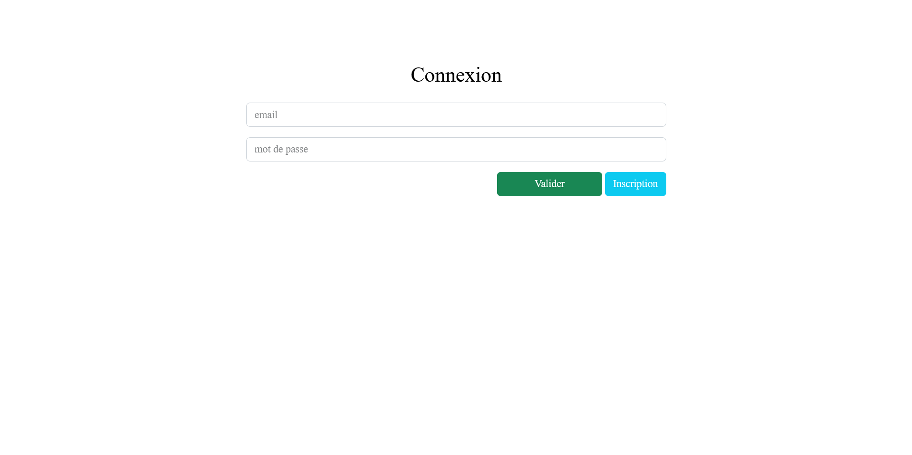
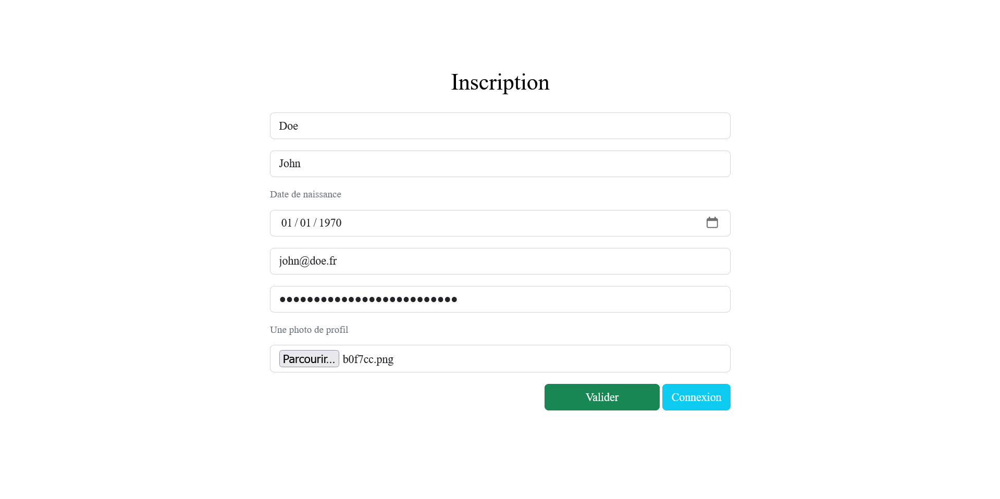

# TP Validation des acquis

---

## Ressources

- [Documentation d'aide à la vérification des données sans les expressions régulières](https://www.php.net/manual/fr/function.filter-var.php)
- [Apprendre les expressions régulières](https://regexlearn.com/fr/learn/regex101)
- [Fonction *preg_match()* combinée aux expressions régulières pour vérifier les données](https://www.php.net/manual/fr/function.preg-match)
- [Fonction *is_numeric()*](https://www.php.net/manual/fr/function.is-numeric.php)
- [Fonction *move_upload()* pour déplacer un fichier *uploadé*](https://www.php.net/manual/fr/function.move-uploaded-file.php)
- [Fonction *empty()*](https://www.php.net/manual/fr/function.empty)
- [Fonction *isset()*](https://www.php.net/manual/fr/function.isset.php)
- [Fonction *filter_input()*](https://www.php.net/manual/fr/function.filter-input.php)
- [Fonction *password_hash()*](https://www.php.net/manual/fr/function.password-hash)
- [Fonction *password_verify()* pour vérifier que 2 mots de passe (un haché et l'autre non) sont identiques](https://www.php.net/manual/fr/function.password-verify.php)
- [Fonction *session_start()*](https://www.php.net/manual/fr/function.session-start.php)
- [Fonction *diff()* de DateTime](https://www.php.net/manual/fr/datetime.diff.php)
- [Tutoriel écrit session](https://www.pierre-giraud.com/php-mysql-apprendre-coder-cours/session-definition-utilisation/)
- [Tutoriel vidéo session](https://www.youtube.com/watch?v=j0a1kQpELRo)
- [Actualités en JSON](./data)
- [Cards de Bootstrap](https://getbootstrap.com/docs/5.0/components/card/)

## Aide validation d'un formulaire sans utiliser les Regex (expressions régulières = motifs pour vérifier qu'une valeur est au format attendu)

Utilisez pour les vérifications la fonctions [empty()](https://www.php.net/manual/fr/function.empty) ou [isset()](https://www.php.net/manual/fr/function.isset.php) ou [filter_input](https://www.php.net/manual/fr/function.filter-input.php) et les conditions pour vérifier que les informations sont remplies.

## Aide validation données d'un formulaire avec l'utilisation des REGEX (en bonus et en option)

- [Apprendre les expressions régulières](https://regexlearn.com/fr/learn/regex101)

Voici des expressions régulières pour les champs du formulaire :
- Email : `"/^([\w-]+(?:\.[\w-]+)*)@((?:[\w-]+\.)*\w[\w-]{0,66})\.([a-z]{2,6}(?:\.[a-z]{2})?)$/i"`
- Nom et prénom :  `"/^[a-z]+(?!_)(\s|-)?[a-z]+\$/i"`
- Mot de passe : `"/^(?!abcdef|qwerty|azerty|123456)(?=.*[a-z])(?=.*[A-Z])(?=.*[0-9])(?=.*[&\$+\-*\/#~€%^!-_]).{15,36}\$/"`, entre 15 et 36 caractères, ne commençant pas par abcedef, ni querty, ni azerty, ni 123456, contenant au moins un chiffre, une lettre minuscule, une lettre majuscule et un caractère spécial entre &, $, -, etc.
- Pour l'age, à partir de la date de naissance, il faut calculer l'age et vérifier que le résultat est supérieur ou égale à 18 et inférieur à 130. Pour cela, vous pouvez utiliser la classe [la fonction diff() à partir d'un objet DateTime de la date de naissance de l'utilisateur à  comparer avec une instance DateTime de la date du jour](https://www.php.net/manual/fr/datetime.diff.php). Si c'est trop compliqué, changez le champ du formulaire de type *date* en *number* côté front et vérifiez l'âge saisi depuis le formulaire est compris entre 18 et 130.

---

## PARTIE I : UML (optionnelle)

- Un utilisateur peut mettre un ou plusieurs actualités dans ses favoris.
- Une actualité est composée d'un titre, d'un contenu, d'une date de publication, d'un auteur, d'un URL et d'une image.
- Un utilisateur possède un nom, prénom, date de naissance, email et mot de passe.
- Un utilisateur peut avoir zéro ou plusieurs photos.

1. Modélisez à l'aide d'un **diagramme de classes UML** les indications précédentes

---

## PARTIE II : HTML (obligatoire)

1. Créez un **formulaire HTML** qui permet d'**insérer un utilisateur** avec toutes les informations associées à ce dernier.
2. Créez un **formulaire HTML** qui permet d'**authentifier un utilisateur** à partir de son ***email*** et son ***mot de passe***.

---

## PARTIE III : CSS (obligatoire)

1. Mettez en forme vos formulaires, un style pour la ***version Mobile***, un autre style pour la ***version Desktop*** (bureau)

---

## PARTIE IV : PHP et Bootstrap (obligatoire)

1. A partir de votre diagramme de classes, créez vos **classes en PHP** en mettant en place les **espaces de noms** à l'aide de **composer**.
2. A l'aide de **Doctrine**, ajoutez les **annotations** et créez les **tables** via les **commandes Doctrine**.
3. **Insérez** les **news(actualités)** depuis les **fichiers JSON** présentes dans le dossier [*data/*](./data)
4. **Insérez** les **utilisateurs** depuis votre **formulaire d'inscription** dans votre base de données.
Vous devez **hacher le mot de passe**, pour cela, utilisez la [fonction *password_hash()*](https://www.php.net/manual/fr/function.password-hash)
5. A partir du formulaire de connexion, **vérifiez le mot de passe en clair saisi par l'utilisateur et le mot de passe haché en base de données**. Vous devez utiliser la [fonction *password_verify()* pour vérifier que 2 mots de passe (un haché et l'autre non) sont identiques](https://www.php.net/manual/fr/function.password-verify.php).
Voici la démarche à suivre : 
- Faites une requête avec ***PDO*** pour récupérer l'email et le mot de passe à partir de l'email saisi par l'utilisateur, par exemple `SELECT email, password FROM user WHERE email="contact@tshimini.fr"`.
- **Comparez le mot de passe en clair avec le mot de passe haché** récupéré depuis la base de données (résultat *true* s'ils sont identiques sinon *false*)
- Si la comparaison est ok, créez des **variables de session** pour stocker l'email, le prénom et le nom. Pour la gestion des sessions, vous pouvez suivre ce [*tutoriel écrit*](https://www.pierre-giraud.com/php-mysql-apprendre-coder-cours/session-definition-utilisation/) ou ce [*tutoriel vidéo*](https://www.youtube.com/watch?v=j0a1kQpELRo)

6. Récupérez les flux d'actualités présentes dans le dossier [data](./data/) et insérez-les dans votre base de données. Attention, l'actualité se trouve dans un tableau à 2 dimensions, dont les clés sont *`['channel']['item']`*
7. Créez une nouvelle page permettant d'afficher les news depuis votre base de données en utilisant les [*cards de Bootstrap*](https://getbootstrap.com/docs/5.0/components/card/)

_. **Affichez depuis la nouvelle page**, *le nom, prénom et adresse email* de l'utilisateur connecté en récupérant ses informations depuis la superglobale ***`$_SESSION`***. Attention, une page qui utilise les variables de session doit démarrer une session à partir de la fonction [*session_start()*](https://www.php.net/manual/fr/function.session-start.php)

---

## PARTIE V : JQuery (Optionnelle)

1. Ajoutez des **animations** dans vos pages à l'aide de JQUERY.

---

## PARTIE VI : évaluation sur HTML, CSS, UML et PHP (obligatoire)

- [Effectuez cette évaluation d'une durée d'environ 30 min chronométré](https://docs.google.com/forms/d/e/1FAIpQLSfiD4NhWpcptSJ3xihZiojCz73UR1eTWtYIskQ3G2uscNDA0w/viewform)

---

## Illustrations non-contractuelles des pages à réaliser (au niveau de l'UI (User Interface) de vos pages, vous êtes libre de faire une autre mise en page tant que vous respectez les informations à afficher)

---

---

